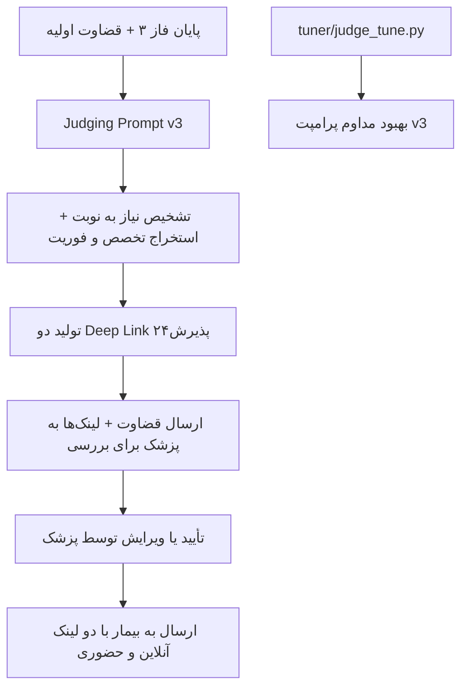

# گزارش فنی ماژول یکپارچگی با پلتفرم‌های نوبت‌دهی و معرفی پزشک (Booking Integration Module)

## روش اجرا:
در این فاز از توسعه پروژه Sayehboun، ماژول یکپارچگی با پلتفرم نوبت‌دهی آنلاین «پذیرش۲۴» پیاده‌سازی و در پرامپت قضاوت (Judging Prompt) ادغام شد. هدف این ماژول، معرفی مناسب‌ترین پزشک و ارائه لینک نوبت‌دهی مستقیم و هوشمند به بیمار، بر اساس خروجی قضاوت هوش مصنوعی است.

### چرا پذیرش۲۴؟
پذیرش۲۴ بزرگترین و dominant پلتفرم نوبت‌دهی سلامت در ایران است. بر اساس رتبه‌بندی Tracxn در سال ۲۰۲۶، پذیرش۲۴ رتبه اول را در میان استارت‌آپ‌های پلتفرم نوبت‌دهی سلامت در ایران کسب کرده و از رقبایی مانند DrDr، Doctoreto و Nobat.ir پیشی گرفته است. این پلتفرم از سال ۲۰۱۵ فعالیت خود را آغاز کرده و هم‌اکنون به عنوان مرجع اصلی جستجو و رزرو نوبت پزشکان در کشور شناخته می‌شود.

### راه‌حل‌های تست‌شده و ناموفق در مقابل راه‌حل مستقر فعلی
پیش از انتخاب راه‌حل فعلی، سه رویکرد مختلف برای معرفی پزشک و ارائه نوبت به بیمار مورد بررسی و تست قرار گرفت که همگی به دلایل فنی و عملیاتی با شکست مواجه شدند:

۱. یکپارچه‌سازی از طریق API رسمی پلتفرم‌ها
این روش نیازمند دسترسی به API رسمی پذیرش۲۴ و سایر پلتفرم‌ها بود. به دلیل سیاست‌های پلتفرم‌ها و عدم ارائه API عمومی یا مستندات کافی، امکان دریافت API فراهم نشد. در نتیجه این رویکرد کاملاً غیرقابل اجرا بود.

۲. Crawl کردن سایت، ذخیره داده‌ها و پیشنهاد بر اساس دیتابیس محلی
در این روش، اطلاعات پزشکان و نوبت‌ها از سایت پذیرش۲۴ crawl شده و در دیتابیس محلی ذخیره می‌شد. مشکلات اصلی این رویکرد عبارت بودند از:
- نقض احتمالی شرایط استفاده از سایت (Terms of Service)
- نیاز به نگهداری مداوم crawler و به‌روزرسانی داده‌ها
- ریسک منسوخ شدن سریع اطلاعات نوبت‌ها
- پیچیدگی حقوقی و فنی بالا

۳. استفاده از Manual Syntax ثابت در مقابل AI Prompt پویا
در ابتدا تلاش شد لینک‌های نوبت‌دهی با syntax دستی و ثابت در پرامپت قضاوت قرار گیرد. این روش انعطاف‌پذیری بسیار پایینی داشت و قادر به تطبیق با تخصص، شهر، نوع نوبت (آنلاین/حضوری) و سطح فوریت نبود. در مقابل، راه‌حل فعلی از AI Prompt (نسخه v2 و v3) استفاده می‌کند که به صورت پویا و context-aware لینک‌ها را تولید می‌کند.

راه‌حل مستقر فعلی (AI Prompt در judging prompt v2 و v3):
با ارتقای پرامپت قضاوت به نسخه‌های v2 (commit 657849e) و v3 (commit 0af3e2b)، هوش مصنوعی قادر شد الگوی URL پذیرش۲۴ را شناسایی کرده و لینک‌های deep link انعطاف‌پذیر و context-aware تولید کند. این لینک‌ها مستقیماً در خروجی قضاوت به بیمار نمایش داده می‌شوند.

نمونه واقعی خروجی تست Sayehboun (که مستقیماً در گزارش قرار می‌گیرد):

🚶 **۱. نیاز به مراجعه به پزشک:**  
بله، به دلیل آسیب ورزشی و ورم خفیف زانو، بررسی توسط پزشک ضروری است.

🕒 **۲. فوریت مراجعه:**  
فوری – نیاز به معاینه در روزهای آینده دارید، اما اورژانسی نیست.

💻🩺 **۳. نوع مراجعه:**  
هر دو – مشاوره آنلاین برای ارزیابی اولیه و در صورت نیاز نوبت حضوری.

👨‍⚕️ **۴. تخصص پیشنهادی:**  
متخصص ارتوپدی

🧊 **۵. اقدامات قبل از مراجعه:**  
– استراحت نسبی و کاهش وزن‌گذاری روی پای راست  
– استفاده از کمپرس یخ (هر ۲ تا ۳ ساعت، ۱۵ دقیقه)  
– بستن زانو با باند کشی (فشرده‌سازی ملایم)  
– بالا نگه داشتن زانو هنگام نشستن یا خواب

⚠️ **۶. مراقبت‌های خانگی و علائم هشدار:**  
– ادامه‌ی RICE (استراحت، یخ، فشار، بالا نگه‌داشتن)  
– در صورت افزایش شدید ورم، درد غیرقابل تحمل، یا عدم توانایی در راه رفتن، فوراً به اورژانس مراجعه کنید.

🔗 **نوبت آنلاین فوری (پذیرش۲۴)**  
برای دسترسی سریع‌تر به پزشک آنلاین متخصص ارتوپدی، از لینک زیر نوبت بگیرید:  
https://www.paziresh24.com/s/tehran/?text=%D9%85%D8%AA%D8%AE%D8%B5%D8%B5+%D8%A7%D8%B1%D8%AA%D9%88%D9%BE%D8%AF%DB%8C&ref=search_suggestion_box_qs&semantic_search=false&turn_type=consult&sortBy=clinic_first_freeturn

🔗 **نوبت حضوری فوری (پذیرش۲۴)**  
برای نزدیک‌ترین نوبت حضوری متخصص ارتوپدی، از لینک زیر استفاده کنید:  
https://www.paziresh24.com/s/tehran/?text=%D9%85%D8%AA%D8%AE%D8%B5%D8%B5+%D8%A7%D8%B1%D8%AA%D9%88%D9%BE%D8%AF%DB%8C&ref=search_suggestion_box_qs&semantic_search=false&sortBy=clinic_first_freeturn&turn_type=non-consult

### نحوه تشخیص الگوی URL پذیرش۲۴ و تولید Deep Link هوشمند
در پرامپت قضاوت نسخه v3، هوش مصنوعی الگوی پایه URL پذیرش۲۴ را به صورت زیر یاد گرفته است:

Base: https://www.paziresh24.com/s/tehran/

پارامترهای کلیدی که به صورت پویا تنظیم می‌شوند:
- text= : نام تخصص (به صورت URL-encoded فارسی، مثلاً متخصص ارتوپدی)
- turn_type=consult : برای نوبت آنلاین
- turn_type=non-consult : برای نوبت حضوری
- sortBy=clinic_first_freeturn : اولویت با نزدیک‌ترین نوبت آزاد
- semantic_search=false
- ref=search_suggestion_box_qs

این ساختار باعث می‌شود لینک‌ها کاملاً context-aware باشند: تخصص از تاریخچه بیمار استخراج می‌شود، نوع نوبت بر اساس سطح فوریت (فوری/غیرفوری) انتخاب می‌گردد، و دو لینک مجزا (آنلاین و حضوری) همیشه در انتهای قضاوت ارائه می‌شود.

تغییرات در commit 0af3e2b (judging prompt v3) این قابلیت را urgency-aware کرده است، به طوری که در موارد فوری، لینک‌ها با sortBy مناسب‌تر ارائه می‌شوند.

### نمودار جریان ماژول یکپارچگی نوبت‌دهی

## نتیجه‌گیری و بحث:
پیاده‌سازی قابلیت یکپارچگی با پذیرش۲۴ از طریق AI Prompt، یک راه‌حل عملی، مقیاس‌پذیر و بدون وابستگی به API یا crawl محسوب می‌شود. این رویکرد نسبت به سه روش قبلی برتری‌های مشخصی دارد.

### مزایای راه‌حل فعلی در مقابل رویکردهای ناموفق
- عدم نیاز به API رسمی (که در دسترس نبود)
- عدم ریسک حقوقی crawl و ذخیره داده
- انعطاف‌پذیری کامل از طریق پرامپت (برخلاف syntax دستی ثابت)
- تولید لینک‌های context-aware بر اساس تخصص، شهر، نوع نوبت و فوریت

### شاخص عملکردی

| شاخص | API Integration | Crawl + Store | Manual Syntax | AI Prompt + Deep Link (مستقر فعلی) |
|------|------------------|---------------|---------------|------------------------------------|
| امکان‌پذیری فنی | غیرممکن (عدم دسترسی به API) | ممکن اما پرریسک | ممکن اما صلب | کاملاً عملی و پویا |
| هزینه نگهداری | — | بالا (crawler + به‌روزرسانی) | پایین | بسیار پایین (فقط پرامپت) |
| انعطاف‌پذیری | — | متوسط | بسیار پایین | بسیار بالا (context-aware) |
| سرعت پیاده‌سازی | — | طولانی | سریع اما محدود | سریع و قابل گسترش |
| تجربه بیمار | — | متوسط | ضعیف | عالی (لینک مستقیم و هوشمند) |

با ارتقای پرامپت به نسخه v3 و اضافه شدن urgency-aware logic، کیفیت پیشنهاد نوبت به بیمار به سطحی رسیده است که پزشک می‌تواند با حداقل ویرایش، قضاوت کامل را تأیید و ارسال کند. این ماژول گامی مهم در جهت خودکارسازی کامل فرآیند triage تا رزرو نوبت محسوب می‌شود.