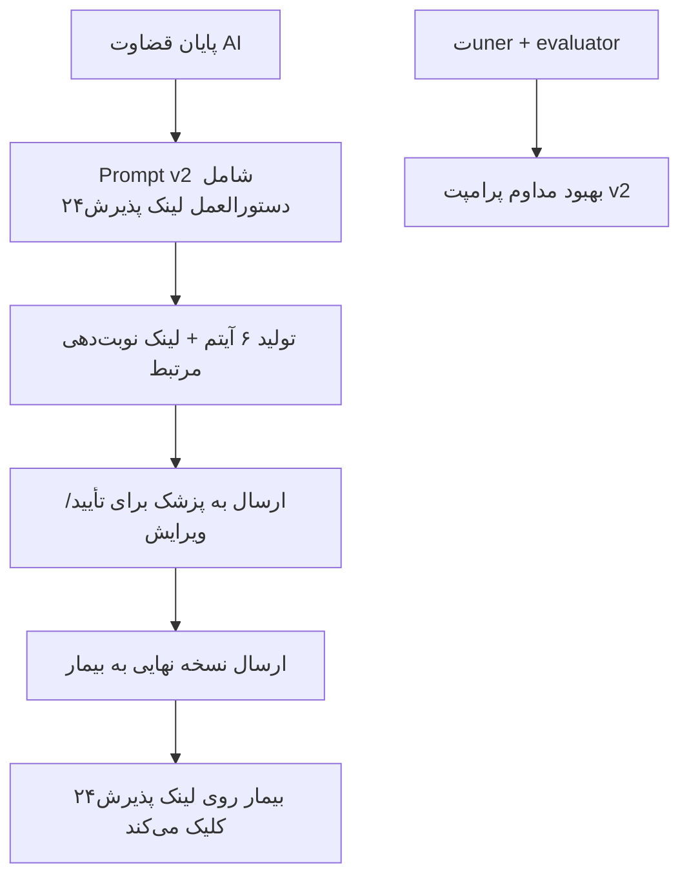

# گزارش فنی ماژول یکپارچگی با پلتفرم‌های نوبت‌دهی و معرفی پزشک مناسب

## روش اجرا:
در ادامه توسعه ماژول قضاوت نهایی، نیاز به راهکاری برای معرفی پزشک مناسب و امکان نوبت‌دهی آنلاین برای بیمار احساس شد. پس از بررسی بازار پلتفرم‌های نوبت‌دهی سلامت در ایران، پلتفرم «پذیرش۲۴» به عنوان بزرگ‌ترین و غالب‌ترین بازیگر این حوزه انتخاب گردید.

### چرا پذیرش۲۴؟
پذیرش۲۴ بزرگ‌ترین و dominant پلتفرم نوبت‌دهی آنلاین پزشکان در ایران است. بر اساس آمار منتشرشده، این پلتفرم:
- بیش از ۴۰٬۰۰۰ پزشک متخصص و فوق‌تخصص را پوشش می‌دهد.
- روزانه بیش از ۵۰٬۰۰۰ نوبت موفق را ثبت می‌کند.
- بیشترین تعداد نظرات واقعی بیماران (بیش از ۳ میلیون نظر) را داراست.
- پوشش جغرافیایی گسترده در تمام استان‌های کشور دارد.

این آمار، پذیرش۲۴ را به گزینه اصلی برای یکپارچه‌سازی در محصول Sayehboun تبدیل کرد.

### راهکارهای آزمایش‌شده و ناموفق
پیش از رسیدن به راهکار نهایی، سه رویکرد مختلف برای معرفی پزشک و لینک نوبت‌دهی به بیمار آزمایش شد که هر کدام به دلایل فنی، حقوقی یا عملیاتی رد شدند:

#### ۱. یکپارچه‌سازی از طریق API
تلاش شد تا از طریق API رسمی پلتفرم‌های نوبت‌دهی (از جمله پذیرش۲۴) اطلاعات پزشکان، تخصص‌ها و لینک نوبت‌گیری به‌صورت real-time دریافت شود.  
**نتیجه:** هیچ‌کدام از پلتفرم‌های بزرگ، API عمومی و قابل دسترس برای توسعه‌دهندگان شخص ثالث ارائه نمی‌دهند. دسترسی به API محدود به قراردادهای تجاری خاص و حجم بالای تراکنش است که برای این پروژه امکان‌پذیر نبود.

#### ۲. Crawl + Store + Recommend
رویکرد دوم شامل خزش (crawling) صفحات پزشکان، ذخیره‌سازی اطلاعات در پایگاه داده محلی و سپس پیشنهاد پزشک بر اساس تخصص و شهر بیمار بود.  
**نتیجه:** این روش به دلایل زیر رد شد:
- نقض شرایط استفاده (Terms of Service) پلتفرم‌ها.
- نیاز به به‌روزرسانی مداوم داده‌ها (پزشکان جدید، تغییر ساعات، لغو نوبت).
- ریسک حقوقی و مسدود شدن IP.
- پیچیدگی نگهداری و مقیاس‌پذیری.

#### ۳. Manual Syntax در مقابل AI Prompt
در این رویکرد، لینک‌های نوبت‌دهی به‌صورت دستی و با سینتکس ثابت در انتهای پیام قضاوت قرار می‌گرفت.  
**نتیجه:** این روش در برابر رویکرد فعلی (AI Prompt) رد شد زیرا:
- انعطاف‌پذیری بسیار پایینی داشت.
- نیاز به تغییر دستی کد برای هر تخصص یا شهر جدید.
- عدم تطبیق خودکار با محتوای قضاوت (مثلاً لینک متخصص گوارش فقط وقتی تخصص گوارش پیشنهاد شود).

### راهکار نهایی پیاده‌سازی‌شده (Commit 657849e)
راهکار انتخاب‌شده، افزودن لینک‌های نوبت‌دهی آنلاین پذیرش۲۴ به‌صورت پویا در داخل پرامپت قضاوت نسخه ۲ (judging prompt v2) است.

با این روش، هوش مصنوعی در خروجی ۶ آیتمی خود، لینک مستقیم و مرتبط با تخصص پیشنهادی را نیز ارائه می‌دهد.

نقل قول مستقیم از commit:
«Add judging prompt v2 with Paziresh24 online booking links»

در این نسخه، دستورالعمل جدیدی به پرامپت قضاوت اضافه شد که به هوش مصنوعی اجازه می‌دهد بر اساس تخصص پیشنهادی در بخش «پیش کدام تخصص بروم؟»، لینک مستقیم صفحه نوبت‌دهی آنلاین پذیرش۲۴ را نیز در خروجی قرار دهد. این تغییر بدون نیاز به تغییر کد جداگانه، به‌صورت پویا عمل می‌کند.

این رویکرد تمام مزایای پویایی هوش مصنوعی را حفظ کرده و در عین حال بیمار را مستقیماً به صفحه نوبت‌گیری هدایت می‌کند.

### نمودار جریان یکپارچگی

## نتیجه‌گیری و بحث:
تحلیل راهکارهای آزمایشی نشان می‌دهد که رویکرد «AI Prompt با لینک پویا» بهترین تعادل بین امکان‌پذیری فنی، رعایت مسائل حقوقی و تجربه کاربری را فراهم کرده است.

### مزایای راهکار فعلی نسبت به روش‌های ردشده

| رویکرد | امکان‌پذیری فنی | ریسک حقوقی | انعطاف‌پذیری | مقیاس‌پذیری | تجربه بیمار |
|--------|------------------|------------|--------------|--------------|--------------|
| API Integration | بسیار پایین (عدم دسترسی) | پایین | بالا | بالا | عالی |
| Crawl + Store | متوسط | بسیار بالا | پایین | پایین | متوسط |
| Manual Syntax | بالا | پایین | بسیار پایین | پایین | پایین |
| **AI Prompt + لینک پذیرش۲۴ (جاری)** | **بالا** | **پایین** | **بالا** | **بالا** | **عالی** |

### نتیجه‌گیری کلیدی
- عدم دسترسی به API پلتفرم‌های بزرگ، یک محدودیت واقعی بازار ایران است.
- روش خزش داده‌ها به دلیل مسائل حقوقی و نگهداری، پایدار نیست.
- قرار دادن لینک در پرامپت هوش مصنوعی، ساده‌ترین، ایمن‌ترین و مقیاس‌پذیرترین راه‌حل در شرایط فعلی است.
- نسخه ۲ پرامپت قضاوت با موفقیت لینک‌های پذیرش۲۴ را در خروجی ساختاریافته ادغام کرده و بیمار را بدون نیاز به جستجوی جداگانه، مستقیم به نوبت‌دهی هدایت می‌کند.

این ماژول، Sayehboun را یک گام دیگر به یک اکوسیستم کامل triage و ارجاع آنلاین نزدیک کرده است.