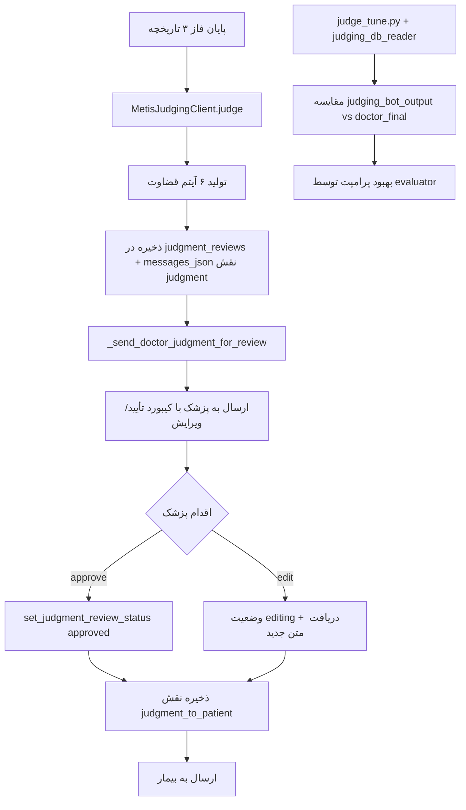

# گزارش فنی ماژول قضاوت نهایی هوش مصنوعی (Judging Module)

## روش اجرا:
در فاز جدید پروژه Sayeh، ماژول «قضاوت نهایی» (Judging) پیاده‌سازی شد. هدف این ماژول، تولید یک ارزیابی ساختاریافته triage توسط هوش مصنوعی و ارسال آن به پزشک برای تأیید یا ویرایش، و سپس ارسال نسخه نهایی به بیمار/همراه بیمار است.

### معماری ذخیره‌سازی و جدول judgment_reviews
برای مدیریت وضعیت بررسی قضاوت توسط پزشک، جدول جدیدی به نام `judgment_reviews` به پایگاه داده اضافه شد:

```sql
CREATE TABLE judgment_reviews (
    session_id INTEGER PRIMARY KEY,
    patient_chat_id TEXT NOT NULL,
    judgment_text TEXT NOT NULL,
    status TEXT NOT NULL DEFAULT 'pending',  -- pending / editing / approved
    created_at TEXT NOT NULL,
    updated_at TEXT NOT NULL
)
```

این جدول وضعیت قضاوت را در سه حالت نگهداری می‌کند:
- `pending`: قضاوت هوش مصنوعی آماده بررسی پزشک است.
- `editing`: پزشک در حال ویرایش قضاوت است.
- `approved`: پزشک قضاوت را تأیید کرده و نسخه نهایی به بیمار ارسال شده است.

ستون `judgment_text` متن اولیه تولیدشده توسط ربات قضاوت را ذخیره می‌کند و پس از اقدام پزشک، وضعیت به‌روز می‌شود.

### کلاینت قضاوت (judging_client.py)
کلاس `MetisJudgingClient` دقیقاً مشابه الگوی `MetisHistoryFormatterClient` پیاده‌سازی شده است:

```python
class MetisJudgingClient:
    def __init__(self, api_key: str, bot_id: str) -> None:
        self.bot = create_metis_bot(api_key=api_key, bot_id=bot_id)
        self._session = None

    def judge(self, payload_text: str) -> str:
        # ایجاد سشن، ارسال پرامپت و دریافت خروجی ۶ آیتمی
```

این کلاینت پرامپت ساختاریافته تاریخچه بیمار را به Metis Judging Bot ارسال کرده و خروجی را دریافت می‌کند.

### پرامپت قضاوت و قالب خروجی
پرامپت قضاوت (موجود در `tuner/prompts/judging_evaluator_instructions.txt` و گزارش‌های tuner) خروجی را به **دقیقاً ۶ آیتم شماره‌دار فارسی** محدود کرده است:

1. پزشک بروم یا نروم؟
2. فوری یا غیرفوری؟
3. حضوری یا آنلاین؟
4. پیش کدام تخصص؟
5. قبل از مراجعه چی کار کنم؟
6. پزشک نروم چی کار کنم؟

هر آیتم شامل ایموجی مناسب، عنوان بولد، و یک خط فاصله خالی بین آیتم‌ها است. این قالب سخت‌گیرانه برای نمایش مناسب در پیام‌رسان بله طراحی شده است.

### جریان کامل در app.py
پس از تکمیل فاز ۳ تاریخچه، تابع `_complete_session_and_notify_doctor` ابتدا گزارش ساختاریافته را از طریق `MetisHistoryFormatterClient` تولید می‌کند. سپس تابع `_send_judgment_to_doctor` فعال می‌شود:

```python
judgment = _judge_with_retry(judging, payload)
db.append_message(session_id, "judgment", judgment)
db.upsert_judgment_review(session_id, chat_id, judgment)
_send_doctor_judgment_for_review(token, doctor_chat_id, session_id, judgment)
```

پزشک قضاوت را همراه با کیبورد تعاملی دریافت می‌کند:

```python
def _doctor_judgment_keyboard() -> dict:
    return {
        "inline_keyboard": [
            [{"text": "👍 تأیید و ارسال", "callback_data": "judgment:approve:..."}],
            [{"text": "✏️ ویرایش", "callback_data": "judgment:edit:..."}]
        ]
    }
```

### هندلرهای Callback پزشک
دو هندلر callback در `app.py` وجود دارد:
- `JUDGMENT_APPROVE_CALLBACK_PREFIX`: وضعیت را به `approved` تغییر داده و متن را با نقش `judgment_to_patient` در messages_json ذخیره و به بیمار ارسال می‌کند.
- `JUDGMENT_EDIT_CALLBACK_PREFIX`: وضعیت را به `editing` تغییر داده و از پزشک می‌خواهد متن ویرایش‌شده را ارسال کند. پس از دریافت متن جدید، نسخه نهایی با نقش `judgment_to_patient` ذخیره و ارسال می‌شود.

### ساب‌سیستم بهینه‌سازی (Tuner)
فایل‌های `judge_tune.py`، `judging_db_reader.py` و `judging_report.py` امکان ارزیابی خودکار پرامپت قضاوت را فراهم کرده‌اند.

تابع `build_judging_evaluator_payload` اطلاعات زیر را به evaluator bot ارسال می‌کند:
- `current_prompt`
- `formatted_history`
- `judging_bot_output` (خروجی اولیه هوش مصنوعی)
- `doctor_final_to_patient` (نسخه نهایی ارسال‌شده به بیمار)
- `doctor_action` (`approved` یا `edited`)

در صورت `edited` بودن، evaluator روی تفاوت‌های اعمال‌شده توسط پزشک تمرکز کرده و پرامپت را بهبود می‌بخشد. نمونه واقعی از گزارش session 81:

```json
{
  "doctor_action": "edited",
  "judging_bot_output": "1. ✅ **پزشک بروم یا نروم؟** ...",
  "doctor_final_to_patient": "1. ✅ **پزشک بروم یا نروم؟** ...\n6. 🏡 **پزشک نروم چی کار کنم؟** \n  نرو.."
}
```

### نمودار جریان ماژول قضاوت



## نتیجه‌گیری و بحث:
پیاده‌سازی ماژول قضاوت نهایی، یک گام مهم در جهت خودکارسازی triage پزشکی و کاهش بار کاری پزشک محسوب می‌شود. نتایج کلیدی عبارتند از:

### کاهش تأخیر و افزایش دقت با بازخورد پزشک
در ساختار قبلی، خروجی هوش مصنوعی مستقیماً به بیمار ارسال می‌شد. با واسط قرار دادن پزشک (approve/edit)، دقت و ایمنی توصیه‌ها به طور چشمگیری افزایش یافته است. داده‌های واقعی tuner نشان می‌دهد که در بسیاری از موارد پزشک اقدام به ویرایش کرده و این ویرایش‌ها به عنوان ground truth برای بهبود پرامپت استفاده می‌شوند.

### حل مشکل N+1 و بازیابی یکپارچه
تمام اطلاعات قضاوت (اولیه و نهایی) در ستون `messages_json` با نقش‌های مجزا (`judgment` و `judgment_to_patient`) ذخیره می‌شود. جدول جداگانه `judgment_reviews` نیز وضعیت بررسی را tracking می‌کند. این طراحی امکان بازیابی کامل وضعیت هر جلسه با یک کوئری را فراهم کرده است.

### انعطاف‌پذیری و نسخه‌بندی پرامپت قضاوت
ساب‌سیستم Tuner Judging با evaluator bot مستقل، امکان بهبود مداوم پرامپت ۶ آیتمی را بدون تغییر کد اصلی فراهم کرده است. نسخه‌بندی در `judging_manifest.json` و فایل‌های جداگانه traceability کامل را تضمین می‌کند.

### شاخص عملکردی

| شاخص | قبل از ماژول قضاوت | بعد از پیاده‌سازی Judging Module | تأثیر عملیاتی |
|------|---------------------|----------------------------------|---------------|
| ارسال مستقیم AI به بیمار | بله (ریسک بالا) | خیر — همیشه از فیلتر پزشک عبور می‌کند | افزایش ایمنی |
| امکان ویرایش پزشک | نداشت | دارد (callback + editing state) | دقت بالاتر |
| بهینه‌سازی خودکار پرامپت | نداشت | دارد (judging_evaluator + doctor_action) | تکامل مداوم |
| ذخیره‌سازی وضعیت بررسی | نداشت | جدول judgment_reviews + status | traceability کامل |
| تعداد درخواست به Metis | ۱ (formatter) | ۲ (formatter + judging) | افزایش جزئی با ارزش افزوده بالا |

این معماری، ماژول قضاوت را به یک سیستم قابل اعتماد، ایمن و قابل بهبود مداوم تبدیل کرده است.